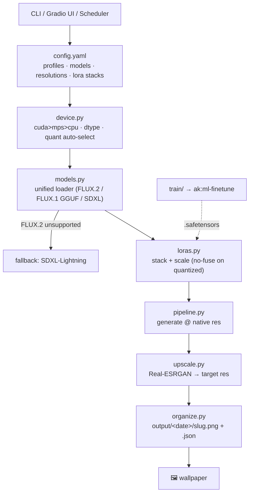

# Flux Wallpaper Generation Pipeline

A self-hosted text-to-image pipeline that wraps [HuggingFace Diffusers](https://github.com/huggingface/diffusers) around Black Forest Labs' **FLUX** models to generate high-resolution desktop wallpapers. It runs on Apple Silicon (MPS) and automatically uses CUDA when a GPU is present, picks a memory-appropriate quantization, supports third-party and custom LoRAs, and can drop a fresh wallpaper on your desktop every morning.

> 📖 Live docs: https://arslankazmi.github.io/flux-wallpaper/

## What it does

- **Two model tiers.** A fast **dev** tier (`FLUX.2-klein-4B`, Q4 GGUF) for quick iteration, and a quality **prod** tier (`FLUX.1-schnell`, GGUF) for the daily wallpaper — one Diffusers code path, swappable via config.
- **Runs anywhere.** Auto-detects `cuda → mps → cpu`, picks `bfloat16`/`float32`, and auto-selects the GGUF quant (`Q8/Q6/Q5/Q4`) that fits your memory. CPU-offloads the heavy FLUX tiers on memory-limited machines.
- **Wallpaper-shaped output.** Generates at a FLUX-native size, then upscales (Real-ESRGAN, Lanczos fallback) to 1080p / 1440p / 4K. Each image gets a JSON sidecar recording the prompt, seed, and settings.
- **LoRA-ready.** Stack third-party or local LoRAs at inference, or train your own (delegates to the finetune workflow).
- **Daily scheduler.** A launchd/cron job generates one wallpaper per day in off-hours and (optionally) sets it as your desktop.
- **Private by default.** All external telemetry (Gradio, HuggingFace) is disabled; the UI binds to localhost. Nothing leaves your machine.

## Architecture



## Model tiers

| Tier | Model | Quant | Speed (M4 MPS) | Use |
|------|-------|-------|----------------|-----|
| dev  | `FLUX.2-klein-4B` | Q4 GGUF | ~30–60 s/img | fast iteration |
| prod | `FLUX.1-schnell`  | auto GGUF | ~2–4 min/img | daily scheduler |
| fallback | `SDXL-Turbo` | — | ~5–15 s/img | when FLUX.2 unavailable / low memory |

FLUX schnell/klein are guidance-distilled → `guidance_scale=0`, 4 steps.

## Quick start

```bash
# Install (lean by default: CPU/MPS torch only — no CUDA stack)
uv sync --extra ui --extra upscale --extra lora      # Mac / dev
# uv sync --extra upscale                             # Linux CPU server (daily job)
# uv sync --no-group cpu --group cuda --extra upscale # NVIDIA GPU host

# Generate one wallpaper
uv run python -m fluxwall generate "a serene misty mountain at dawn, ultrawide" -r hd

# Batch from a prompt file
uv run python -m fluxwall batch prompts/wallpapers.txt -r qhd

# Interactive web UI (localhost, no telemetry)
uv run python -m fluxwall ui

# Inspect config
uv run python -m fluxwall list-models
uv run python -m fluxwall loras
```

## LoRAs

```bash
# Use a named stack from config.yaml, or ad-hoc adapters:
uv run python -m fluxwall generate "cyberpunk city" --loras cinematic
uv run python -m fluxwall generate "cyberpunk city" --lora some-org/neon-flux:0.8 --lora loras/mine.safetensors:0.6
```

Drop local `.safetensors` into `loras/`. Because LoRA fusing is unreliable on GGUF-quantized weights, requesting any LoRA automatically loads an unquantized base.

### Train your own

```bash
# Curate a captioned-image dataset (image.png + image.txt, or metadata.jsonl), then:
uv run python -m fluxwall train --dataset path/to/dataset --config flux_lora_default
```

Training is handed off to the FLUX LoRA finetune workflow (SimpleTuner/kohya); the resulting `.safetensors` lands in `loras/` for immediate use.

## Daily wallpaper (off-hours)

The `daily` command rotates through `prompts/wallpapers.txt` (one per day), generates at the prod tier, and sets your desktop.

- **macOS:** edit paths in `fluxwall/scheduler/com.arslankazmi.fluxwall.daily.plist`, copy to `~/Library/LaunchAgents/`, then `launchctl load …`.
- **Linux:** add the line from `fluxwall/scheduler/flux-wallpaper.cron` to your crontab.

## Dependency footprint

torch is split into conflicting `cpu` / `cuda` dependency-groups so the multi-GB CUDA stack is **never** installed unless you ask for it (`--group cuda`). Heavy features (`ui`, `upscale`, `lora`, `train`) are opt-in extras, keeping Docker/inference images small.

## Development

```bash
uv run pytest          # logic tests (model loads are mocked — no GPU needed)
```

## License & credits

Apache-2.0. Built on [Diffusers](https://github.com/huggingface/diffusers), Black Forest Labs [FLUX](https://huggingface.co/black-forest-labs), [city96](https://huggingface.co/city96) & [unsloth](https://huggingface.co/unsloth) GGUF quantizations, and [Real-ESRGAN](https://github.com/xinntao/Real-ESRGAN). See [ASSET_CREDITS.md](ASSET_CREDITS.md).
